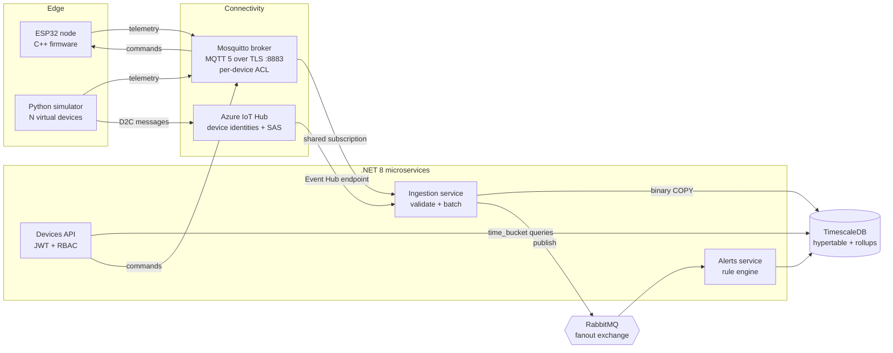

# Architecture

## Data flow

1. **Device → broker.** The ESP32 publishes JSON telemetry to
   `fieldsense/devices/{id}/telemetry` every 10 s over TLS. It also registers a
   retained Last Will on `.../status` so the platform sees `offline` if it drops.
2. **Broker → Ingestion.** Ingestion replicas join the MQTT 5 shared subscription
   `$share/ingestion/...`, so the broker load-balances messages between them.
   With `Ingestion__Source=AzureIoTHub` the same service reads from IoT Hub's
   Event Hub-compatible endpoint instead.
3. **Validation.** Payloads are parsed and range-checked; the device id inside the
   payload must match the topic (or the IoT Hub authenticated identity).
4. **Storage.** Valid messages go into a bounded in-memory channel (back-pressure)
   and are flushed in batches (500 rows or 1 s) with PostgreSQL binary `COPY`.
5. **Events.** Each stored message is published to the `fieldsense.telemetry`
   fanout exchange. Any number of downstream services can subscribe.
6. **Alerts.** The Alerts service evaluates rules (trap triggered, low/critical
   battery, high temperature, weak signal), suppresses repeats with a cooldown,
   and stores alerts. Messages are acked only after the alert is saved.
7. **API.** Operators query devices, downsampled telemetry, and alerts, and can
   send commands (`blink`, `set_interval`) back to devices.

## Security by layer

| Layer | Control |
|---|---|
| Device ↔ broker | TLS 1.2, broker certificate pinned to private CA on the device |
| Device identity | Username = device id; ACL limits each device to its own topics |
| Azure path | IoT Hub per-device SAS keys; device id taken from IoT Hub system property |
| Payload | Schema and range validation, topic/device id match (anti-spoofing) |
| Services ↔ broker | Separate MQTT users with least-privilege ACLs, CA-validated TLS |
| API | JWT bearer tokens; RBAC policies (`viewer` read-only, `operator` can command) |
| Secrets | `config.h`, certs and password files are git-ignored; env vars in compose |

## Time-series design

- `telemetry` is a TimescaleDB hypertable, partitioned into 1-day chunks.
- Index on `(device_id, time DESC)` serves per-device range queries.
- Chunks older than 7 days are compressed (segmented by device); raw data is
  dropped after 90 days.
- `telemetry_hourly` continuous aggregate keeps long-term hourly rollups.

## Scaling notes

- Ingestion scales horizontally (shared subscription / Event Hub partitions).
- Alerts can scale by running more consumers on the same durable queue.
- Cooldown state is in-memory per Alerts instance; at scale it would move to Redis.
